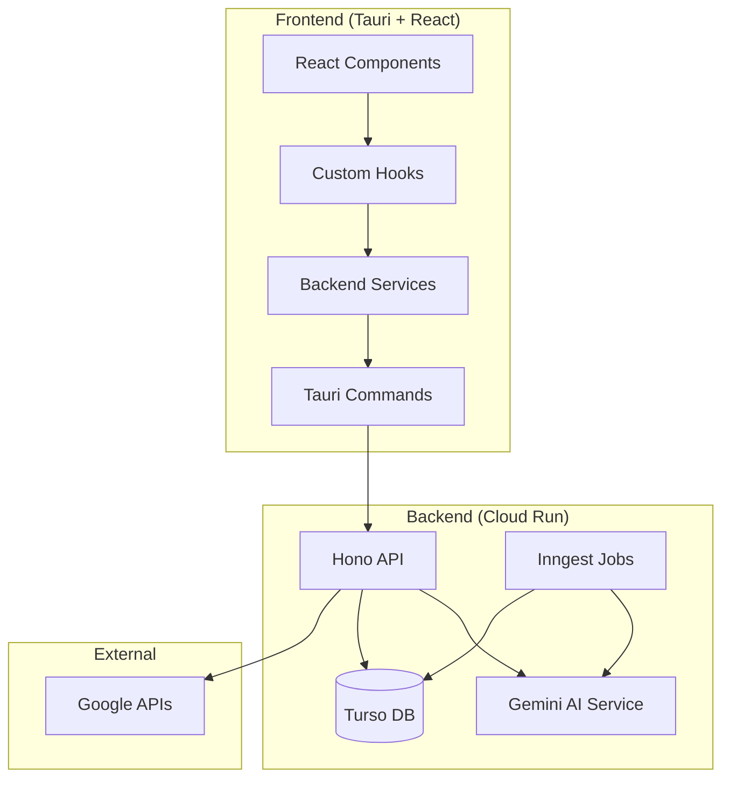
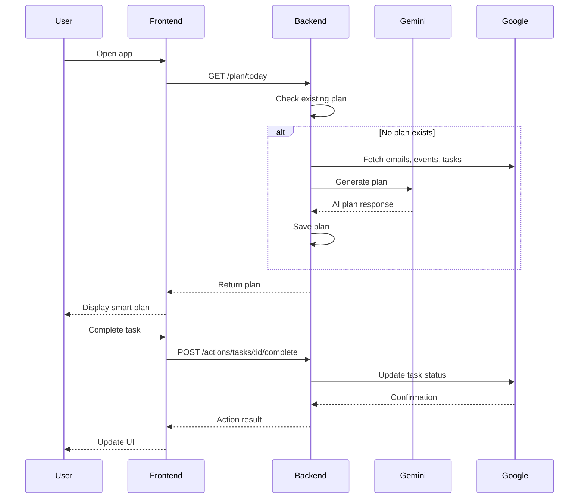

# Design Document: AI-Powered Daily Experience

## Overview

Este diseño describe la integración completa entre el backend existente (Hono + Inngest + Gemini AI en Cloud Run) y el frontend Tauri/React. El objetivo es transformar la aplicación de un visor de datos estático a una experiencia de productividad inteligente con planes AI, acciones reales, y notificaciones proactivas.

### Current State
- Backend tiene: AI plan generation, task actions, notifications, memory system, Inngest jobs
- Frontend tiene: Vista estática de emails/eventos/tareas sin interacción real
- Gap: No hay conexión entre las capacidades AI del backend y la UI

### Target State
- Plan diario generado por AI con focus blocks, quick wins, y sugerencias
- Acciones reales sobre tareas (crear, completar, eliminar)
- Sistema de notificaciones con badge y lista
- Feedback loop para personalización
- Sincronización automática con indicador de estado

## Architecture



## Components and Interfaces

### 1. Frontend Services Layer

#### Plan Service (`src/services/backend/plan.ts`)

```typescript
interface PlanTask {
  id: string;
  title: string;
  type: 'task' | 'email' | 'meeting' | 'focus' | 'break';
  priority: 'high' | 'medium' | 'low';
  duration_minutes: number;
  suggested_time?: string;
  context?: string;
  source_id?: string;
  source_type?: 'task' | 'email' | 'calendar';
}

interface DailyPlan {
  date: string;
  summary: string;
  energy_tip?: string;
  focus_blocks: PlanTask[];
  quick_wins: PlanTask[];
  meetings: PlanTask[];
  defer_suggestions: string[];
  generated_at: number;
}

// Get today's AI-generated plan
async function getTodayPlan(): Promise<DailyPlan | null>;

// Force regenerate plan
async function regeneratePlan(): Promise<DailyPlan>;

// Submit feedback on plan
async function submitPlanFeedback(planId: string, score: number, notes?: string): Promise<void>;
```

#### Actions Service (`src/services/backend/actions.ts`)

```typescript
interface ActionResult {
  success: boolean;
  action_id: string;
  message: string;
  data?: unknown;
}

interface CreateTaskInput {
  title: string;
  notes?: string;
  due_date?: string;
  task_list_id?: string;
}

// Create a new task in Google Tasks
async function createTask(input: CreateTaskInput): Promise<ActionResult>;

// Mark task as completed
async function completeTask(taskId: string, listId?: string): Promise<ActionResult>;

// Delete a task
async function deleteTask(taskId: string, listId?: string): Promise<ActionResult>;

// Update task details
async function updateTask(taskId: string, updates: Partial<CreateTaskInput>): Promise<ActionResult>;
```

#### Notifications Service (`src/services/backend/notifications.ts`)

```typescript
interface Notification {
  id: string;
  type: 'reminder' | 'task_due' | 'plan_ready' | 'email_summary' | 'system';
  title: string;
  body?: string;
  data?: Record<string, unknown>;
  priority: 'low' | 'normal' | 'high';
  createdAt: number;
  readAt?: number;
}

// Get notifications
async function getNotifications(limit?: number, includeRead?: boolean): Promise<Notification[]>;

// Get unread count
async function getUnreadCount(): Promise<number>;

// Mark as read
async function markAsRead(notificationId: string): Promise<void>;

// Mark all as read
async function markAllAsRead(): Promise<void>;
```

### 2. React Hooks Layer

#### useDailyPlan Hook

```typescript
interface UseDailyPlanReturn {
  plan: DailyPlan | null;
  isLoading: boolean;
  isGenerating: boolean;
  error: string | null;
  regenerate: () => Promise<void>;
  submitFeedback: (score: number, notes?: string) => Promise<void>;
}

function useDailyPlan(): UseDailyPlanReturn;
```

#### useTaskActions Hook

```typescript
interface UseTaskActionsReturn {
  createTask: (input: CreateTaskInput) => Promise<ActionResult>;
  completeTask: (taskId: string) => Promise<ActionResult>;
  deleteTask: (taskId: string) => Promise<ActionResult>;
  isLoading: boolean;
  lastAction: ActionResult | null;
}

function useTaskActions(): UseTaskActionsReturn;
```

#### useNotifications Hook

```typescript
interface UseNotificationsReturn {
  notifications: Notification[];
  unreadCount: number;
  isLoading: boolean;
  markAsRead: (id: string) => Promise<void>;
  markAllAsRead: () => Promise<void>;
  refresh: () => Promise<void>;
}

function useNotifications(): UseNotificationsReturn;
```

#### useSyncStatus Hook

```typescript
interface SyncStatus {
  status: 'idle' | 'syncing' | 'synced' | 'error';
  lastSyncAt: number | null;
  error?: string;
}

interface UseSyncStatusReturn {
  syncStatus: SyncStatus;
  triggerSync: (source?: 'gmail' | 'calendar' | 'tasks' | 'all') => Promise<void>;
}

function useSyncStatus(): UseSyncStatusReturn;
```

### 3. UI Components

#### SmartDailyPlan Component

Reemplaza el DailyPlan actual con una versión que usa el plan AI:

```typescript
interface SmartDailyPlanProps {
  onTaskComplete?: (taskId: string) => void;
  onTaskCreate?: (task: CreateTaskInput) => void;
}

function SmartDailyPlan(props: SmartDailyPlanProps): JSX.Element;
```

Secciones:
- Header con greeting, fecha, y botón de regenerar
- Focus Blocks: Bloques de trabajo profundo sugeridos
- Quick Wins: Tareas rápidas para momentum
- Meetings: Eventos del calendario con join links
- Defer Suggestions: Items que pueden esperar

#### NotificationBell Component

```typescript
interface NotificationBellProps {
  onClick?: () => void;
}

function NotificationBell(props: NotificationBellProps): JSX.Element;
```

Muestra badge con count y dropdown con lista de notificaciones.

#### TaskActionButton Component

```typescript
interface TaskActionButtonProps {
  taskId: string;
  action: 'complete' | 'delete';
  onSuccess?: () => void;
  onError?: (error: string) => void;
}

function TaskActionButton(props: TaskActionButtonProps): JSX.Element;
```

#### SyncIndicator Component

```typescript
function SyncIndicator(): JSX.Element;
```

Muestra estado de sincronización (spinning cuando syncing, check cuando synced, error icon cuando falla).

#### QuickTaskInput Component

```typescript
interface QuickTaskInputProps {
  onTaskCreated?: (task: ActionResult) => void;
}

function QuickTaskInput(props: QuickTaskInputProps): JSX.Element;
```

Input inline para crear tareas rápidamente.

## Data Models

### Plan Data Flow



### State Management

```typescript
// Global app state
interface AppState {
  auth: {
    isAuthenticated: boolean;
    user: User | null;
  };
  plan: {
    current: DailyPlan | null;
    isLoading: boolean;
    lastGenerated: number | null;
  };
  notifications: {
    items: Notification[];
    unreadCount: number;
  };
  sync: {
    status: 'idle' | 'syncing' | 'synced' | 'error';
    lastSyncAt: number | null;
  };
}
```

## Correctness Properties

*A property is a characteristic or behavior that should hold true across all valid executions of a system-essentially, a formal statement about what the system should do. Properties serve as the bridge between human-readable specifications and machine-verifiable correctness guarantees.*


### Property 1: Plan Structure Completeness

*For any* generated DailyPlan, the plan object SHALL contain non-null arrays for focus_blocks, quick_wins, meetings, and defer_suggestions, plus non-empty strings for summary and date.

**Validates: Requirements 1.4, 1.5**

### Property 2: Plan Regeneration Updates Timestamp

*For any* plan regeneration request, the new plan's generated_at timestamp SHALL be greater than the previous plan's generated_at timestamp.

**Validates: Requirements 1.8**

### Property 3: Action Execution Returns Result

*For any* valid task action (create, complete, delete, update), the Action_Executor SHALL return an ActionResult with success=true and a non-empty action_id.

**Validates: Requirements 2.1, 2.2**

### Property 4: Action Logging Consistency

*For any* action executed through the Action_Executor, there SHALL exist a corresponding entry in action_logs with matching action_type, target_id, and status.

**Validates: Requirements 2.5**

### Property 5: UI State Consistency After Actions

*For any* action that succeeds, the UI state SHALL reflect the change. *For any* action that fails, the UI state SHALL revert to the pre-action state.

**Validates: Requirements 2.3, 2.4**

### Property 6: Notification Creation for Due Tasks

*For any* task with due_date within 2 hours of current time and status='needsAction', there SHALL exist a notification of type='task_due' for that task.

**Validates: Requirements 3.1**

### Property 7: Notification Count Consistency

*For any* user, the unread notification count displayed in the UI SHALL equal the count of notifications where readAt is null.

**Validates: Requirements 3.4, 3.6**

### Property 8: Sync Updates Timestamp

*For any* successful sync operation, the user's last_sync timestamp SHALL be updated to a value greater than or equal to the sync start time.

**Validates: Requirements 4.4**

### Property 9: Memory Storage on Feedback

*For any* plan feedback submission with score and optional notes, there SHALL exist a memory entry of scope='episodic' containing the feedback data.

**Validates: Requirements 5.1**

### Property 10: Memory Expiration

*For any* memory with expires_at less than current timestamp, the memory SHALL be deleted by the cleanup job.

**Validates: Requirements 5.4**

### Property 11: Focus Blocks Don't Overlap Meetings

*For any* generated plan, no focus_block's time range SHALL overlap with any meeting's time range.

**Validates: Requirements 6.3**

### Property 12: Important Emails Prioritized

*For any* plan containing email items, emails marked as is_important=true SHALL appear before emails with is_important=false within the same section.

**Validates: Requirements 7.4**

### Property 13: Offline Fallback to Cache

*For any* API request that fails due to network error, the Frontend_App SHALL return cached data if available, or display an offline indicator.

**Validates: Requirements 8.4**

## Error Handling

### API Errors

| Error Type | HTTP Status | Frontend Handling |
|------------|-------------|-------------------|
| Not authenticated | 401 | Redirect to login, clear tokens |
| Token expired | 401 | Auto-refresh token, retry request |
| AI not configured | 503 | Show "AI unavailable" message |
| Rate limited | 429 | Show retry countdown |
| Network error | - | Use cached data, show offline indicator |
| Server error | 500 | Show generic error, allow retry |

### Action Errors

```typescript
interface ActionError {
  code: 'NOT_FOUND' | 'UNAUTHORIZED' | 'GOOGLE_API_ERROR' | 'VALIDATION_ERROR';
  message: string;
  retryable: boolean;
}

// Error handling in hooks
function handleActionError(error: ActionError): void {
  if (error.retryable) {
    // Show retry button
  } else {
    // Show error message and revert UI
  }
}
```

### Offline Mode

```typescript
// Cache strategy
const CACHE_KEYS = {
  PLAN: 'rainy_day_plan',
  TASKS: 'rainy_day_tasks',
  EVENTS: 'rainy_day_events',
  NOTIFICATIONS: 'rainy_day_notifications',
};

// On successful API response, cache data
function cacheResponse<T>(key: string, data: T): void {
  localStorage.setItem(key, JSON.stringify({
    data,
    cachedAt: Date.now(),
  }));
}

// On network error, return cached data
function getCachedData<T>(key: string, maxAge: number = 3600000): T | null {
  const cached = localStorage.getItem(key);
  if (!cached) return null;
  
  const { data, cachedAt } = JSON.parse(cached);
  if (Date.now() - cachedAt > maxAge) return null;
  
  return data as T;
}
```

## Testing Strategy

### Unit Tests

Unit tests will cover:
- Service functions (API calls, data transformation)
- Hook logic (state management, side effects)
- Component rendering (conditional display, user interactions)
- Utility functions (date formatting, URL generation)

### Property-Based Tests

Property-based tests will use **fast-check** library for TypeScript to validate the correctness properties defined above.

Configuration:
- Minimum 100 iterations per property test
- Each test tagged with: **Feature: ai-powered-daily-experience, Property {number}: {property_text}**

Key property tests:
1. Plan structure validation
2. Action result consistency
3. Notification count invariant
4. Memory expiration behavior
5. Focus block scheduling constraints

### Integration Tests

Integration tests will cover:
- Full flow: login → sync → plan generation → task action
- Error scenarios: network failure, token expiration
- Offline mode: cached data display

### Test File Structure

```
src/
├── services/backend/
│   ├── plan.ts
│   ├── plan.test.ts
│   ├── actions.ts
│   ├── actions.test.ts
│   ├── notifications.ts
│   └── notifications.test.ts
├── hooks/
│   ├── useDailyPlan.ts
│   ├── useDailyPlan.test.ts
│   ├── useTaskActions.ts
│   ├── useTaskActions.test.ts
│   └── useNotifications.ts
└── components/
    ├── plan/
    │   ├── SmartDailyPlan.tsx
    │   └── SmartDailyPlan.test.tsx
    └── notifications/
        ├── NotificationBell.tsx
        └── NotificationBell.test.tsx
```
